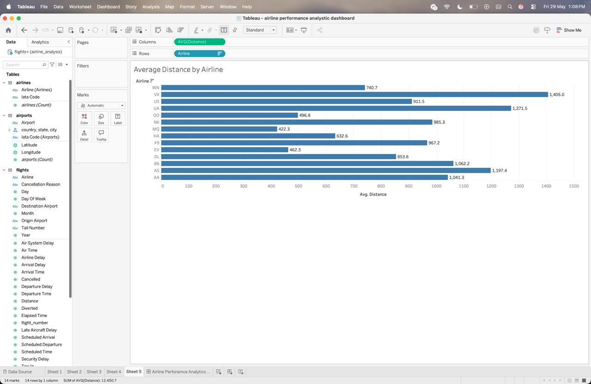
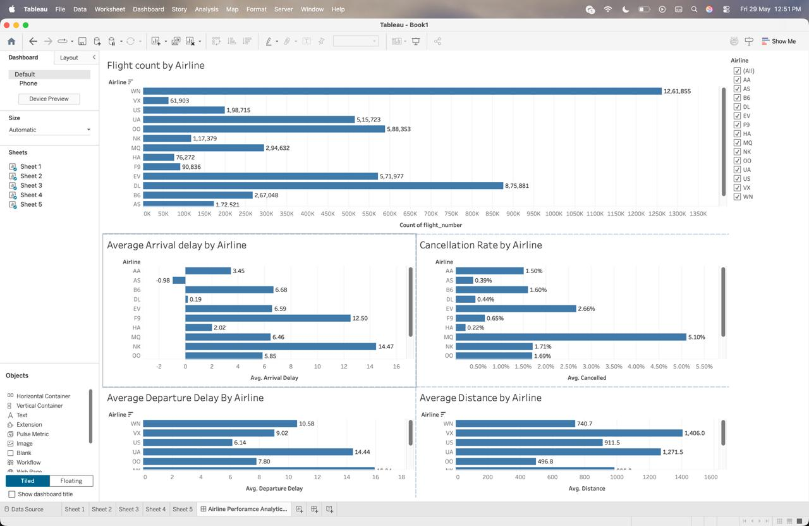
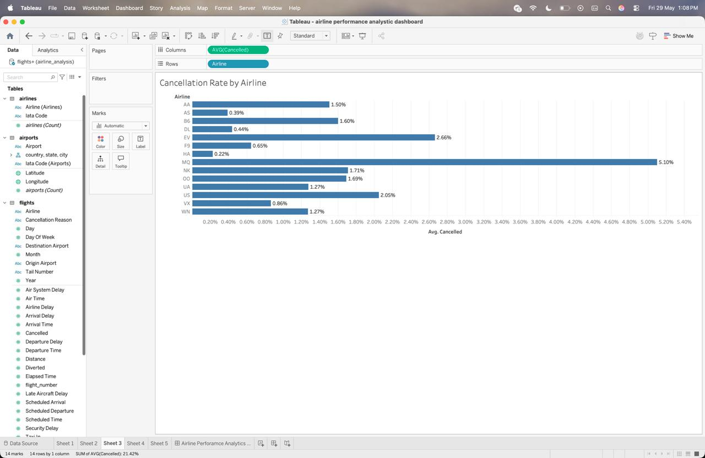
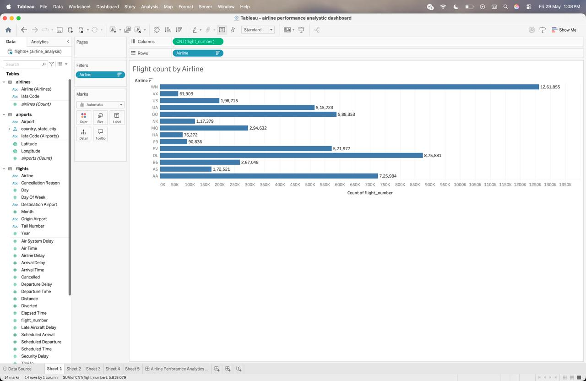

# ✈️ Airline Performance Analytics Dashboard

## 📌 Project Overview

This project analyzes airline operational performance using **SQL** and **Tableau**. The dashboard provides insights into flight volume, arrival delays, departure delays, cancellation rates, and average flight distance across multiple airlines.

The goal of this project is to transform raw airline data into meaningful business insights through data analysis and visualization.

---

## 🛠️ Tools & Technologies

* Tableau
* PostgreSQL
* SQL
* Data Analysis
* Data Visualization

---

## 📊 Dataset Information

The dataset contains airline operational records, including:

* Flight Number
* Airline
* Origin Airport
* Destination Airport
* Arrival Delay
* Departure Delay
* Cancellation Status
* Flight Distance

---

## 📈 Dashboard Features

### 1. Flight Count by Airline

Displays the total number of flights operated by each airline.

### 2. Average Arrival Delay by Airline

Compares airline performance based on average arrival delays.

### 3. Average Departure Delay by Airline

Measures departure punctuality across airlines.

### 4. Cancellation Rate by Airline

Shows the percentage of cancelled flights for each airline.

### 5. Average Distance by Airline

Compares the average distance traveled by airlines.

---

## 🔍 Key Insights

* Identified airlines operating the highest number of flights.
* Analyzed arrival and departure delay patterns.
* Evaluated airline cancellation performance.
* Compared average flight distances across airlines.
* Generated business insights through interactive visualizations.

---

## 💡 Skills Demonstrated

* SQL Query Writing
* Data Analysis
* Data Preparation
* Database Management
* Tableau Dashboard Development
* Data Visualization
* Business Intelligence
* Insight Generation

---

## 📷 Dashboard Preview


### Flight Count by Airline



### Average Arrival Delay by Airline



### Cancellation Rate by Airline


### Average Departure Delay by Airline



### Average Distance by Airline



---

## 📁 Project Structure

```text
Airline-Performance-Analytics-Dashboard/
│
├── README.md
├── airline performance analytic dashboard.twb
├── SQL/
│   └── airline_analysis_queries.sql
│
└── Screenshot/
    ├── dashboard.jpg
    ├── IMG_20260529_132732_051.jpg
    ├── IMG_20260529_132732_262.jpg
    ├── IMG_20260529_132732_300.jpg
    ├── IMG_20260529_132732_403.jpg
    └── IMG_20260529_132732_941.jpg
```

---

## 👨‍💻 Author

**Aditya Singh**

MCA Student | Aspiring Data Analyst

### Connect with Me

* LinkedIn: https://www.linkedin.com/in/aditya07oct/
* GitHub: https://github.com/aditya07singh

---

⭐ If you found this project useful, feel free to star the repository.
